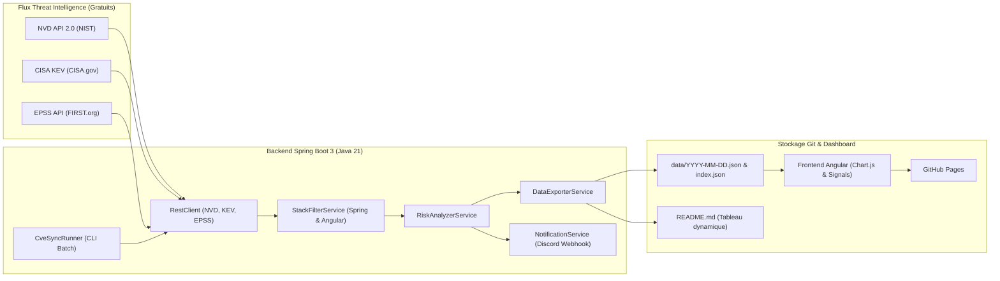

# 🛡️ CVEille

<p align="center">
  
  
  
  
  
</p>

> **CVEille** est un pipeline automatisé de veille et de renseignement sur les menaces de cybersécurité (*Threat Intelligence*).  
> Il collecte quotidiennement les nouvelles vulnérabilités (CVE), les croise avec les catalogues d'exploitation active (**CISA KEV**) et de probabilité prédictive (**EPSS**), filtre spécifiquement les technologies d'entreprise (**Spring Boot, Angular & écosystèmes associés**), et met à jour un tableau de bord interactif hébergé sur **GitHub Pages**.

🔗 **Dashboard en ligne** : [https://florianppn.github.io/CVEille/](https://florianppn.github.io/CVEille/)

---

<!-- CVEILLE_SUMMARY_START -->
### 🛡️ État de la veille CVEille (Stack Spring Boot & Angular)

> **Dernière synchronisation** : `2026-10-01T12:36:34.086311565Z`  
> **Vulnérabilités suivies** : `21` | 🔥 **Exploits CISA KEV** : `0` | 🚨 **Critiques** : `4` | ⚠️ **Élevées** : `8`

| CVE ID | Sévérité | CVSS | EPSS | KEV | Stack | Description |
|---|---|---|---|---|---|---|
| [CVE-2026-53988](https://nvd.nist.gov/vuln/detail/CVE-2026-53988) | `CRITICAL` | 10.0 | N/A | Non | `docker` | Dockhand before 1.0.40 contains an authentication bypass vulnerability in its... |
| [CVE-2026-55494](https://nvd.nist.gov/vuln/detail/CVE-2026-55494) | `CRITICAL` | 9.8 | N/A | Non | `docker` | Tugtainer is a self-hosted app for automating updates of Docker containers. P... |
| [CVE-2026-55181](https://nvd.nist.gov/vuln/detail/CVE-2026-55181) | `CRITICAL` | 9.4 | N/A | Non | `docker` | Tugtainer is a self-hosted app for automating updates of Docker containers. P... |
| [CVE-2026-62308](https://nvd.nist.gov/vuln/detail/CVE-2026-62308) | `CRITICAL` | 9.1 | N/A | Non | `docker` | Tugtainer is a self-hosted app for automating updates of Docker containers. P... |
| [CVE-2026-102676](https://nvd.nist.gov/vuln/detail/CVE-2026-102676) | `HIGH` | 8.3 | N/A | Non | `node.js` | Electron is a framework for writing cross-platform desktop applications using... |
| [CVE-2026-102826](https://nvd.nist.gov/vuln/detail/CVE-2026-102826) | `HIGH` | 8.1 | N/A | Non | `node.js` | simple-git, an interface for running git commands in any node.js application,... |
| [CVE-2026-102827](https://nvd.nist.gov/vuln/detail/CVE-2026-102827) | `HIGH` | 8.1 | N/A | Non | `node.js` | simple-git, an interface for running git commands in any node.js application,... |
| [CVE-2026-87004](https://nvd.nist.gov/vuln/detail/CVE-2026-87004) | `HIGH` | 8.1 | N/A | Non | `docker` | Tugtainer is a self-hosted app for automating updates of Docker containers. P... |

*Dashboard interactif complet disponible sur [GitHub Pages](https://florianppn.github.io/CVEille/)*
<!-- CVEILLE_SUMMARY_END -->

---

## 🎯 Pourquoi ce projet ?

Les flux bruts de CVE publient des dizaines voire des centaines de vulnérabilités par jour. La grande majorité concerne des équipements ou logiciels que vous n'utilisez pas, et moins de 5% sont réellement exploitées.

**CVEille résout ce problème grâce à un filtrage et une priorisation ciblée :**
1. **Filtrage contextuel** : Seules les failles impactant votre stack d'entreprise sont retenues.
2. **Priorisation par le risque réel** : Une faille CVSS 9.8 sans exploit dans la nature est moins urgente qu'une faille CVSS 7.2 activement exploitée par des rançongiciels (**CISA KEV**).
3. **Automatisation propre** : Un cron quotidien met à jour les données et **ne committe que s'il y a de nouvelles données** (aucun commit vide ou artificiel).

---

## 🔬 Méthodologie Threat Intelligence (Le Triptyque)

| Source | Description | Pourquoi est-ce essentiel ? |
|---|---|---|
| **NVD API 2.0 (NIST)** | Base officielle mondiale des CVE et scores **CVSS v3.1** | Mesure la **gravité intrinsèque théorique** de la faille (impact sur confidentialité, intégrité, disponibilité). |
| **CISA KEV Catalog** | *Known Exploited Vulnerabilities* (catalogue de l'agence fédérale US) | **La preuve formelle d'exploitation active**. Si une CVE est dans le KEV, elle doit être corrigée en urgence absolue. |
| **EPSS (FIRST.org)** | *Exploit Prediction Scoring System* (modèle de machine learning) | Estime la **probabilité qu'une faille soit exploitée dans les 30 jours**. Complète parfaitement le score CVSS. |

---

## 🏗️ Architecture & Technologies



### Stack Technique
- **Backend & Pipeline** :
  - **Java 21** & **Spring Boot 3.3.4**
  - **Spring RestClient** avec timeouts, retries exponentielles et gestion du rate-limiting NIST
  - **Jackson** pour la sérialisation des modèles JSON
  - **JUnit 5** & **AssertJ** pour les tests unitaires automatisés
- **Frontend & Visualisation** :
  - **Angular 19+** (Standalone Components, Signals réactifs, TypeScript)
  - **Chart.js** pour la visualisation des sévérités et des composants ciblés
  - Thème sombre moderne inspiré des centres d'opérations de sécurité (SOC)
  - Déployé directement sur **GitHub Pages**
- **CI/CD & Alerting** :
  - **GitHub Actions** : workflow quotidien (`0 6 * * *`) avec commits conditionnels stricts (`git diff --staged --quiet`)
  - **Discord Webhook** pour l'alerte immédiate en cas de CVE critique ou présente dans le CISA KEV

---

## 🛠️ Stack surveillée par défaut

- **Écosystème Spring / Java** : `spring`, `spring-boot`, `spring-security`, `spring-framework`, `spring-cloud`, `tomcat`, `hibernate`, `jackson`, `log4j`, `logback`
- **Écosystème Angular / Frontend** : `angular`, `typescript`, `rxjs`, `ngrx`, `node.js`, `npm`
- **Infrastructure & Services** : `docker`, `kubernetes`, `postgresql`, `nginx`, `keycloak`

*Les mots-clés et seuils d'alerte sont facilement configurables dans `backend/src/main/resources/application.yml`.*

---

## 🚀 Lancement en local

### 1. Prérequis
- Java 21+ (`openjdk 21` ou supérieur)
- Maven 3.9+
- Node.js 20+ et npm

### 2. Exécuter la synchronisation CVE (Mode Batch CLI)
```bash
cd backend
mvn spring-boot:run -Dspring-boot.run.arguments="--sync"
```

### 3. Lancer le serveur backend en mode API REST
```bash
cd backend
mvn spring-boot:run
# Endpoints accessibles :
# GET  http://localhost:8080/api/cves
# GET  http://localhost:8080/api/stats
# POST http://localhost:8080/api/sync
```

### 4. Lancer le frontend Angular
```bash
cd frontend
npm install
npm start
# Rendez-vous sur http://localhost:4200/
```

### 5. Compiler pour GitHub Pages
```bash
cd frontend
npm run build
# Les fichiers statiques prêts pour GitHub Pages sont générés dans ../docs
```

---

## 🔐 Configuration des Secrets GitHub (Optionnels)

Dans les **Settings > Secrets and variables > Actions** de votre repository GitHub :

| Secret | Rôle |
|---|---|
| `NVD_API_KEY` | *(Optionnel)* Clé gratuite de l'API NVD du NIST pour augmenter la cadence de requêtes. |
| `DISCORD_WEBHOOK_URL` | *(Optionnel)* URL de Webhook Discord pour recevoir instantanément les alertes critiques. |

---

## 📜 Licence
Distribué sous licence **MIT**. Voir `LICENSE` pour plus d'informations.
